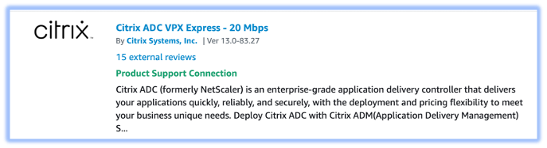
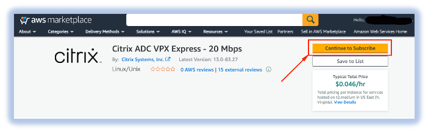
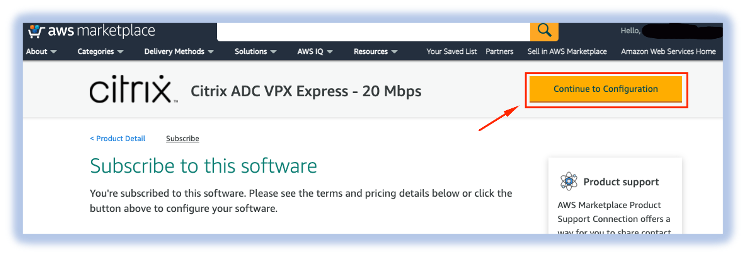
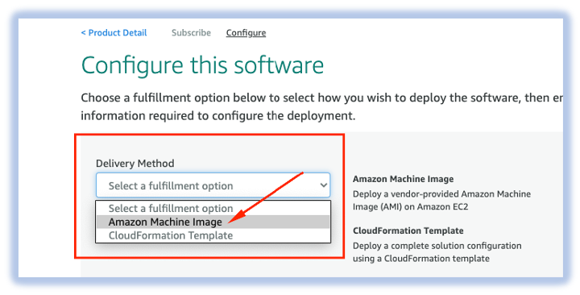
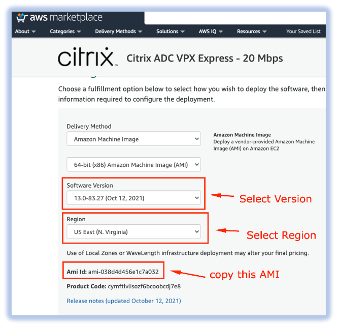

# How to find a particular AMI for a Citrix ADC Product in AWS Marketplace

1. Click [here](https://aws.amazon.com/marketplace/search/results?searchTerms=citrix+adc+vpx&CREATOR=fb9c6078-b60f-47f6-8622-49d5e1d5aca7&filters=CREATOR) to go to Citrix’s ADC AWS products offerings
2. Click the desired product. (__eg., Citrix ADC VPX Express – 20 Mbps__)
  - 
3. Click on **Continue to Subscribe**
  - 
4. Click on **Continue to Configuration**
  - 
5. Select Delivery Method as **Amazon Machine Image**
  - 
6. Select **Software Version**, **Region**, copy the AMI. 
  - 