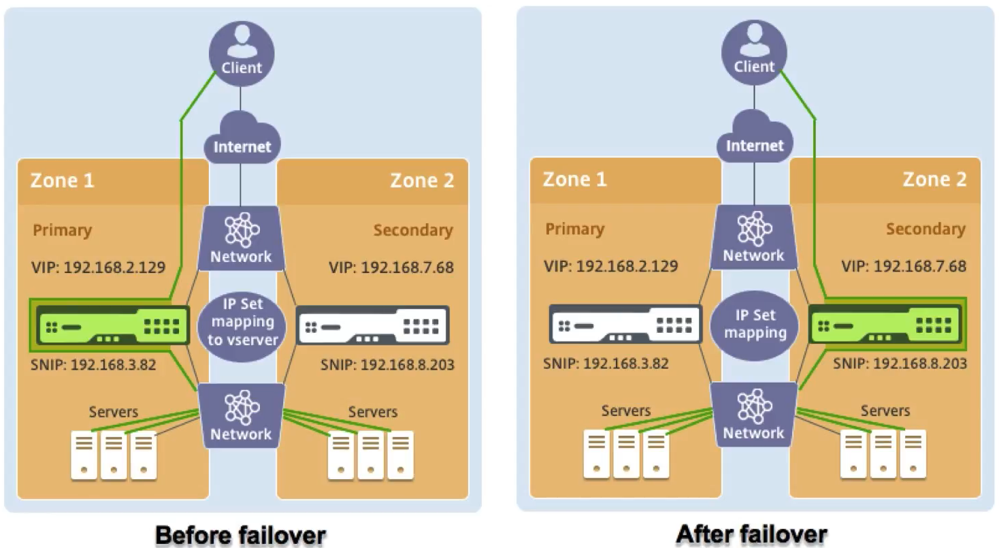

# For External Apps

## CloudFormation Template description

This template provisions two Citrix ADC VPX in two different AWS Availability Zones and configures them as High-Availabile. This template also gives an option to allocate Pooled License to Citrix ADCs while provisioning.
This template creates the below resources:

* IAM Role required for HA configuration
* 3 Security Groups
  * Management Security Group for management (NSIP) interfaces
  * Client Security Group for client (VIP) interfaces
  * Server Security Group for server (SNIP) interfaces
* 6 Elastic Network Interfaces (3 for each Citrix ADCs)
  * Primary Citrix ADC
    * Management interface (eth0)
    * Client interface (eth1)
    * Server interface (eth2)
  * Secondary Citrix ADC
    * Management interface (eth0)
    * Client interface (eth1)
    * Server interface (eth2)
* 3 Elastic IPs `User has option not to create these EIPs`
  * Management EIP for Primary Citrix ADC
  * Management EIP for Secondary Citrix ADC
  * Client EIP for VIP `<--This EIP gets migrated from Primary to Secondary (new-primary) upon HA failover`

## Pre-requisites

> If VPC, subnets, iGateway do not already exists and ADCs are to be provisioned on fresh resources, refer [vpc-infra](../../vpc-infra/) to create the prequisite infra

The CloudFormation template requires sufficient IAM previliges to create IAM roles, beyond normal EC2 full privileges. The user of this template also needs to [accept the terms and subscribe to the AWS Marketplace product](https://aws.amazon.com/marketplace/pp/B00AA01BOE/) before using this CloudFormation template.

The following should be present

* VPC connected to Internet Gateway
* 6 Subnetworks (3 each in every availability zone)
  * Primary VPX Subnets
    * Management side Subnet
    * Client side Subnet
    * Servers side Subnet
  * Secondary VPX Subnets
    * Management side Subnet
    * Client side Subnet
    * Servers side Subnet
* 3 unallocated EIPs
* 1 more unallocated EIP for ADMAgent, if provisioning of ADMAgent option is enabled.
* EC2 KeyPair

### VPC pre-requisite

> The resources in Management Subnet must be reachable to the below AWS endpoints -

* `ec2.amazonaws.com`
* `s3.amazonaws.com`

## Network architecture

## Quick Launch Links

|Region|CFT|
|--|--|
|**US East (N. Virginia)** us-east-1||
|**US East (Ohio)** us-east-2||
|**US West (N. California)** us-west-1||
|**US West (Oregon)** us-west-2||
|**Canada (Central)** ca-central-1||
|**Asia Pacific (Hong Kong)** ap-east-1||
|**Asia Pacific (Mumbai)** ap-south-1||
|**Asia Pacific (Tokyo)** ap-northeast-1||
|**Asia Pacific (Seoul)** ap-northeast-2||
|**Asia Pacific (Singapore)** ap-southeast-1||
|**Asia Pacific (Sydney)** ap-southeast-2||
|**Europe (Frankfurt)** eu-central-1||
|**Europe (Ireland)** eu-west-1||
|**Europe (London)** eu-west-2||
|**Europe (Paris)** eu-west-3||
|**Europe (Stockholm)** eu-north-1||
|**South America (São Paulo)** sa-east-1||

## Additional Links

* **Citrix ADC VPX on AWS**: <https://docs.citrix.com/en-us/citrix-adc/13/deploying-vpx/deploy-aws.html>
* **High availability across AWS availability zones**: <https://docs.citrix.com/en-us/citrix-adc/13/deploying-vpx/deploy-aws/high-availability-different-zones.html>
* **How High Availability on AWS works** : <https://docs.citrix.com/en-us/citrix-adc/13/deploying-vpx/deploy-aws/how-aws-ha-works.html>
* **Citrix ADC Overview** : <https://www.citrix.com/en-in/products/citrix-adc/>
