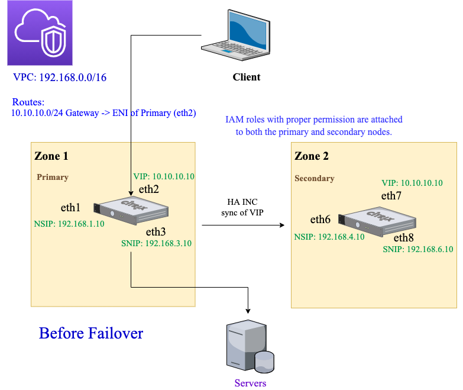
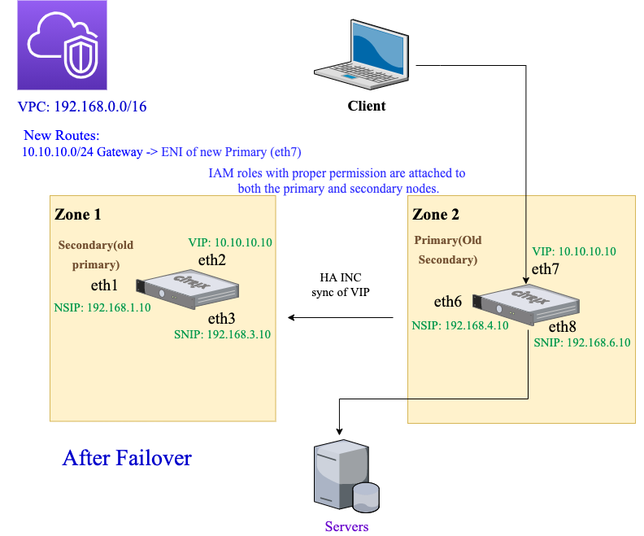

## CloudFormation Template description

This template provisions two Citrix ADC VPX in two different AWS Availability Zones and configures them as High-Availabile using Private IP.

The template creates the below resources:

* IAM Role required for HA configuration
* 3 Security Groups
  + Management Security Group for management (NSIP) interfaces
  + Client Security Group for client (VIP) interfaces
  + Server Security Group for server (SNIP) interfaces
* 6 Elastic Network Interfaces (3 for each Citrix ADCs)
  + Primary Citrix ADC
    - Management interface (eth0)
    - Client interface (eth1)
    - Server interface (eth2)
  + Secondary Citrix ADC
    - Management interface (eth0)
    - Client interface (eth1)
    - Server interface (eth2)
* 2 Elastic IPs `User has option not to create these EIPs`
  + Management EIP for Primary Citrix ADC
  + Management EIP for Secondary Citrix ADC
* Optional LB vserver

## Pre-requisites
> This template works for builds from 13.0-76.31 (March 24, 2021) AMI releases

> If VPC, subnets, iGateway do not already exists and ADCs are to be provisioned on fresh resources, refer [vpc-infra](../../vpc-infra/) to create the prequisite infra

The CloudFormation template requires sufficient IAM previliges to create IAM roles, beyond normal EC2 full privileges. The user of this template also needs to [accept the terms and subscribe to the AWS Marketplace product](https://aws.amazon.com/marketplace/pp/B00AA01BOE/) before using this CloudFormation template.

The following should be present

* VPC
* 6 Subnetworks (3 each in every availability zone)
  + Primary VPX Subnets
    - Management side Subnet
    - Client side Subnet
    - Servers side Subnet
  + Secondary VPX Subnets
    - Management side Subnet
    - Client side Subnet
    - Servers side Subnet
* 2 unallocated EIPs, if the user is opting for EIPs for management interfaces
* EC2 KeyPair

## Post-deployment steps
The users are required to change the password post deployment when asked.
## Network architecture

## Quick Launch Links

|Region|CFT|
|--|--|
|**US East (N. Virginia)** us-east-1||
|**US East (Ohio)** us-east-2||
|**US West (N. California)** us-west-1||
|**US West (Oregon)** us-west-2||
|**Canada (Central)** ca-central-1||
|**Asia Pacific (Hong Kong)** ap-east-1||
|**Asia Pacific (Mumbai)** ap-south-1||
|**Asia Pacific (Tokyo)** ap-northeast-1||
|**Asia Pacific (Seoul)** ap-northeast-2||
|**Asia Pacific (Singapore)** ap-southeast-1||
|**Asia Pacific (Sydney)** ap-southeast-2||
|**Europe (Frankfurt)** eu-central-1||
|**Europe (Ireland)** eu-west-1||
|**Europe (London)** eu-west-2||
|**Europe (Paris)** eu-west-3||
|**Europe (Stockholm)** eu-north-1||
|**South America (São Paulo)** sa-east-1||

## Additional Links:

* [Citrix ADC VPX on AWS](https://docs.citrix.com/en-us/citrix-adc/13/deploying-vpx/deploy-aws.html)
* [Deploy a VPX high-availability pair with private IP addresses across different AWS zones](https://docs.citrix.com/en-us/citrix-adc/current-release/deploying-vpx/deploy-aws/vpx-ha-pip-different-aws-zones.html)
* [Citrix ADC HA with private IP now available across multizones in AWS](https://www.citrix.com/blogs/2020/11/03/citrix-adc-ha-with-private-ip-now-available-across-multizones-in-aws/)
* [How High Availability on AWS works](https://docs.citrix.com/en-us/citrix-adc/13/deploying-vpx/deploy-aws/how-aws-ha-works.html)
* [Citrix ADC Overview](https://www.citrix.com/en-in/products/citrix-adc/)
