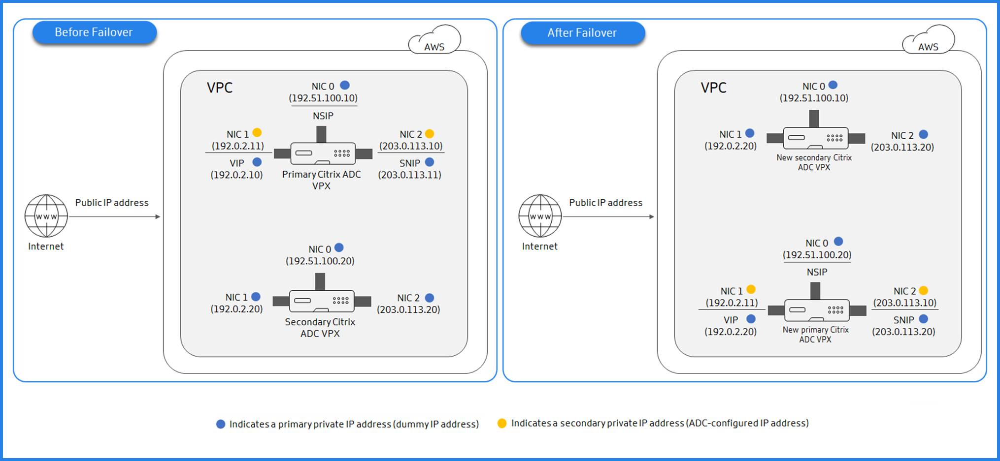

## CloudFormation Template description

This template provisions two Citrix ADC VPX in two different AWS Availability Zones and configures them as High-Availabile. This template also gives an option to allocate Pooled License to Citrix ADCs while provisioning.
This template:
- Provisions two CitrixADC and configure them in HA mode
- After deployment, each CitrixADC instance will have
  - 3 ENIs associated to same Management, Client and Server subnets
  - 2 EIPs for each CitrixADC instance for Management
  - 1 EIP for Client VIP >
	- 1 Client EIP for VIP `<--This EIP gets migrated from Primary to Secondary (new-primary) upon HA failover`
  - Required IAM Role

## Pre-requisites
> If VPC, subnets, iGateway do not already exists and ADCs are to be provisioned on fresh resources, refer [vpc-infra](../../vpc-infra/) to create the prequisite infra
The CloudFormation template requires sufficient IAM previliges to create IAM roles, beyond normal EC2 full privileges. The user of this template also needs to [accept the terms and subscribe to the AWS Marketplace product](https://aws.amazon.com/marketplace/pp/B00AA01BOE/) before using this CloudFormation template.

The following should be present

- VPC connected to Internet Gateway
- 3 Subnetworks (all in same availability zone)
    - Management side Subnet
    - Client side Subnet
    - Server side Subnet
- 3 unallocated EIPs
- EC2 KeyPair

## Network architecture

## Quick Launch Links
|Region|CFT|
|--|--|
|**US East (N. Virginia)** us-east-1||
|**US East (Ohio)** us-east-2||
|**US West (N. California)** us-west-1||
|**US West (Oregon)** us-west-2||
|**Canada (Central)** ca-central-1||
|**Asia Pacific (Hong Kong)** ap-east-1||
|**Asia Pacific (Mumbai)** ap-south-1||
|**Asia Pacific (Tokyo)** ap-northeast-1||
|**Asia Pacific (Seoul)** ap-northeast-2||
|**Asia Pacific (Singapore)** ap-southeast-1||
|**Asia Pacific (Sydney)** ap-southeast-2||
|**Europe (Frankfurt)** eu-central-1||
|**Europe (Ireland)** eu-west-1||
|**Europe (London)** eu-west-2||
|**Europe (Paris)** eu-west-3||
|**Europe (Stockholm)** eu-north-1||
|**South America (São Paulo)** sa-east-1||

## Additional Links:
- **Citrix ADC VPX on AWS**: https://docs.citrix.com/en-us/citrix-adc/13/deploying-vpx/deploy-aws.html
- **Deploy a high availability pair on AWS** : https://docs.citrix.com/en-us/citrix-adc/13/deploying-vpx/deploy-aws/vpx-aws-ha.html
- **How High Availability on AWS works** : https://docs.citrix.com/en-us/citrix-adc/13/deploying-vpx/deploy-aws/how-aws-ha-works.html
- **Citrix ADC Overview** : https://www.citrix.com/en-in/products/citrix-adc/
