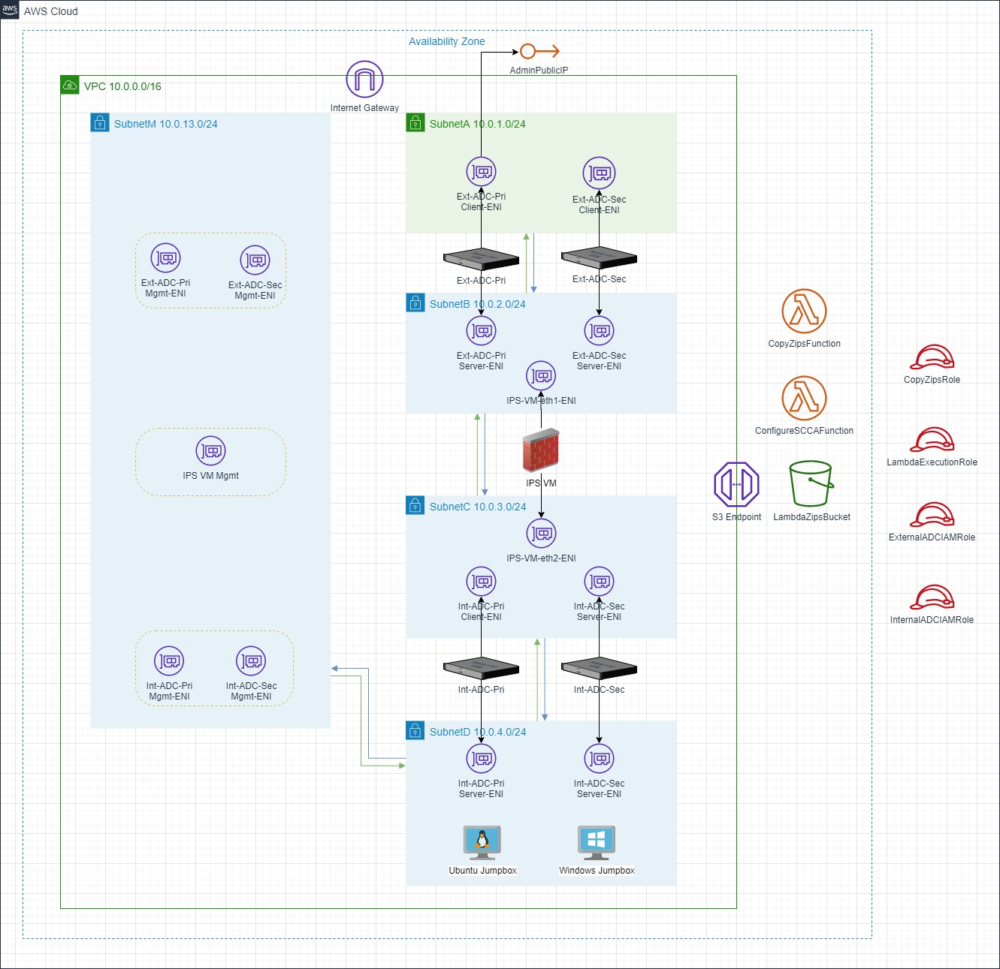

# Deploying Secure Cloud Computing Architecture in AWS
> Refer [here](https://github.com/citrix/citrix-adc-azure-templates/tree/master/templates/saca) for *Azure-SCCA deployment*

## Contents
- [Description](#description)
- [What is SCCA](#what-is-secured-cloud-computing-architecture-scca)

## Description
This AWS CloudFormation Template will deploy resources as per SCCA. 

## What is Secured Cloud Computing Architecture (SCCA)?

## What is included in this deployment

## Prerequisites

## Network Architecture

## Deployment Steps

## Template parameters

## Tempalte outputs

## Further Reading
1. **Citrix ADC**: https://www.citrix.com/en-in/products/citrix-adc/
2. **Citrix ADC VPX on AWS**: https://docs.citrix.com/en-us/citrix-adc/13/deploying-vpx/deploy-aws.html
