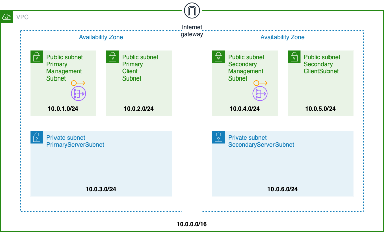

# VPC Infrastructure

## Network Architecture
Below is the network architecture which will be deployed.

## Quick Launch Links

|Region|CFT|
|--|--|
|**US East (N. Virginia)** us-east-1||
|**US East (Ohio)** us-east-2||
|**US West (N. California)** us-west-1||
|**US West (Oregon)** us-west-2||
|**Canada (Central)** ca-central-1||
|**Asia Pacific (Hong Kong)** ap-east-1||
|**Asia Pacific (Mumbai)** ap-south-1||
|**Asia Pacific (Tokyo)** ap-northeast-1||
|**Asia Pacific (Seoul)** ap-northeast-2||
|**Asia Pacific (Singapore)** ap-southeast-1||
|**Asia Pacific (Sydney)** ap-southeast-2||
|**Europe (Frankfurt)** eu-central-1||
|**Europe (Ireland)** eu-west-1||
|**Europe (London)** eu-west-2||
|**Europe (Paris)** eu-west-3||
|**Europe (Stockholm)** eu-north-1||
|**South America (São Paulo)** sa-east-1||